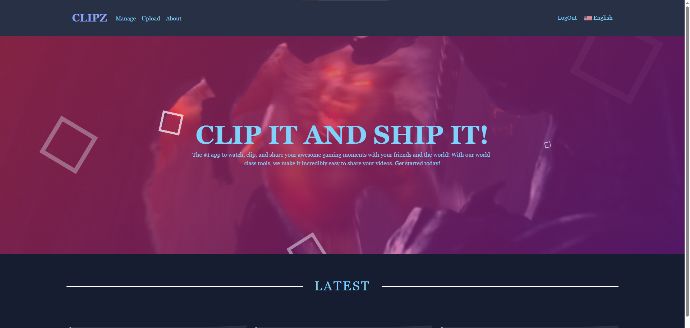
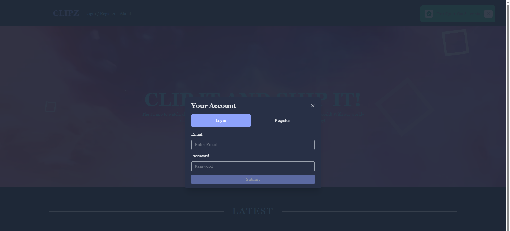

# Web App using Angular 17, Tailwind CSS, FlowBite, Firebase, and Web Assembly

## Overview

This is a fully functional web application built using Angular 17, Tailwind CSS, and FlowBite. It uses Firebase for server-side operations and database management. The application also leverages Web Assembly for uploading and editing videos on the site.

## Features

- **Angular 17**: This project is built using Angular 17, a platform for building web applications.
- **Tailwind CSS & FlowBite**: The UI is designed using Tailwind CSS, a utility-first CSS framework, and FlowBite, a set of components and utilities for Tailwind CSS.
- **Firebase**: Firebase is used for server-side operations, Authentication and Authorization for the Application, As well as a database for the application.
- **Web Assembly**: Web Assembly is used for editing videos on the site.

## OverView

## Installation

1. Clone the repository
2. Install dependencies with `npm install`
3. Set up your Firebase configuration
4. Run the application with `ng serve`

## Usage

After running `ng serve`, navigate to `http://localhost:4200/` in your web browser. The app will automatically reload if you change any of the source files.

## Contributing

Contributions are welcome. Please read the CONTRIBUTING.md for details on our code of conduct, and the process for submitting pull requests.

## License

This project is licensed under the MIT License - see the LICENSE.md file for details.
